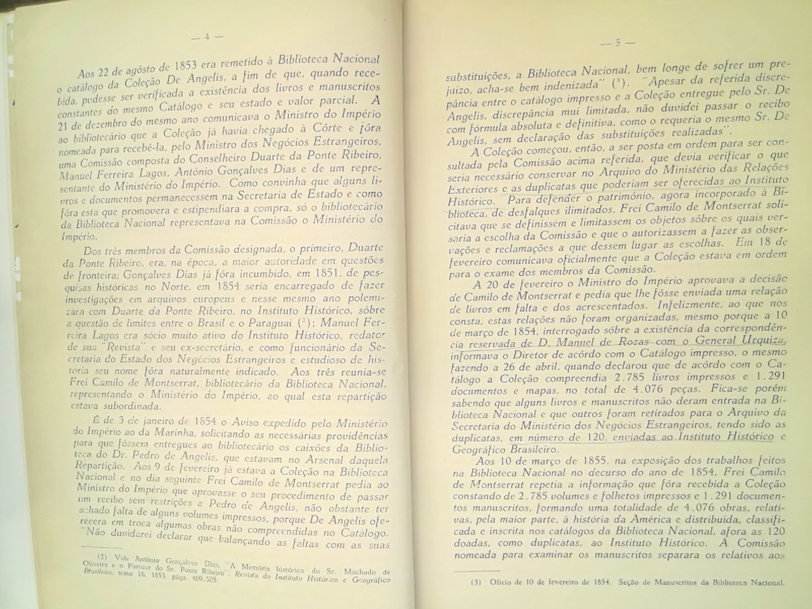
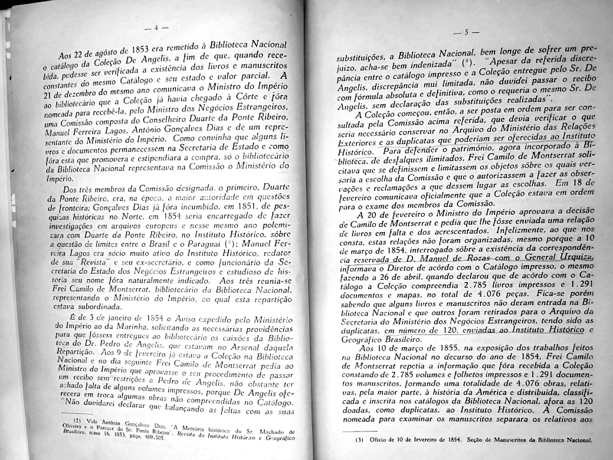
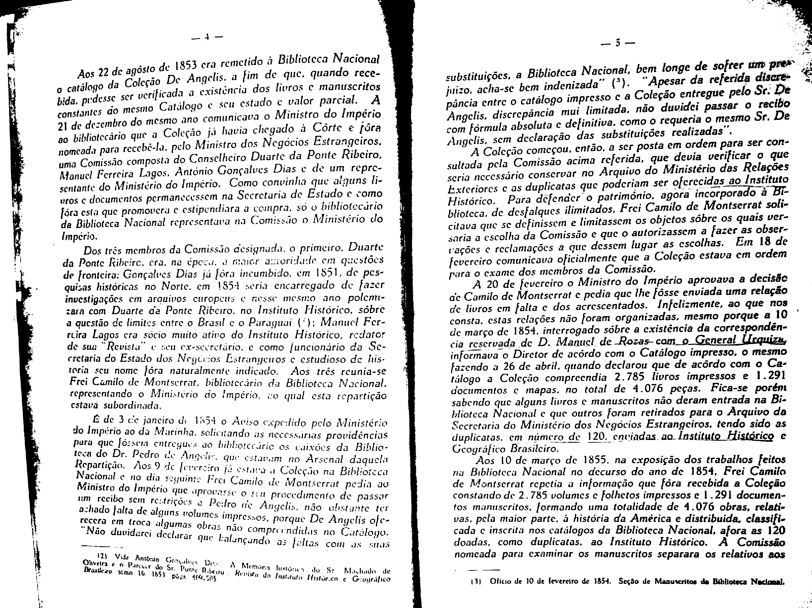

Image Cleaning
==============
Take the below image as an example.

Contrast
--------
After getting individual images, we want the images to be clearer and easier for OCR to read. So we need to do some image cleaning, such as enhancing contrast of images and changing the color of images to black and white. Assume the name of the image is 1.jpg. All the parameters in the following code can be changed based on different situations and requirements. First we increase the contrast of images. ::

 from PIL import Image
 from PIL import ImageEnhance

 image = Image.open('1.jpg')

 enh_con = ImageEnhance.Contrast(image)
 contrast = 3
 image = enh_con.enhance(contrast)

The result output is:

Black&White
-----------
Next, we change the color of images into black and white. ::

 def binarizing(img,threshold):
    img = img.convert("L")

    pixdata = img.load()
    w, h = img.size

    for y in range(h):
        for x in range(w):
            if pixdata[x, y] < threshold:
                pixdata[x, y] = 0
            else:
                pixdata[x, y] = 255
    return img

 image = binarizing(image, 160)

 image.save('1.jpg')

The result output after black and white is:

