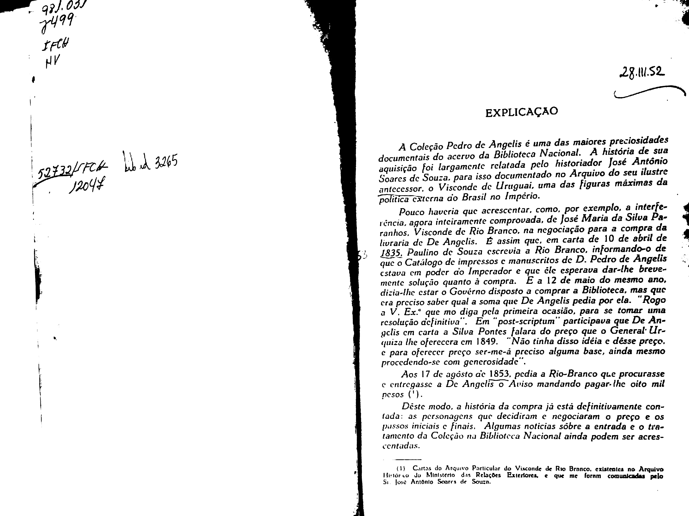
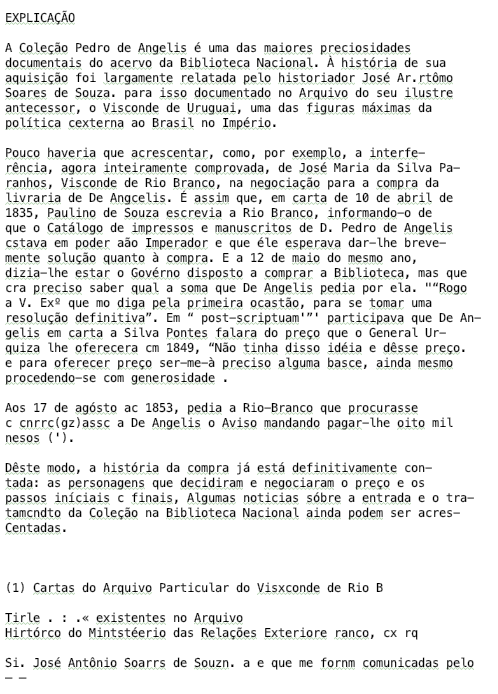
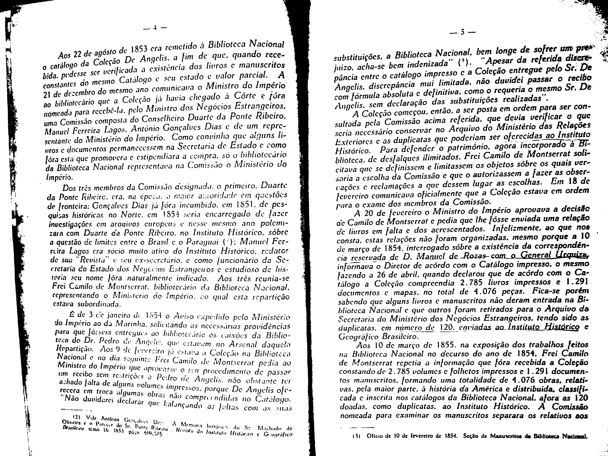
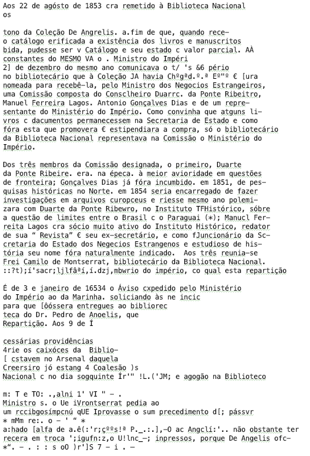
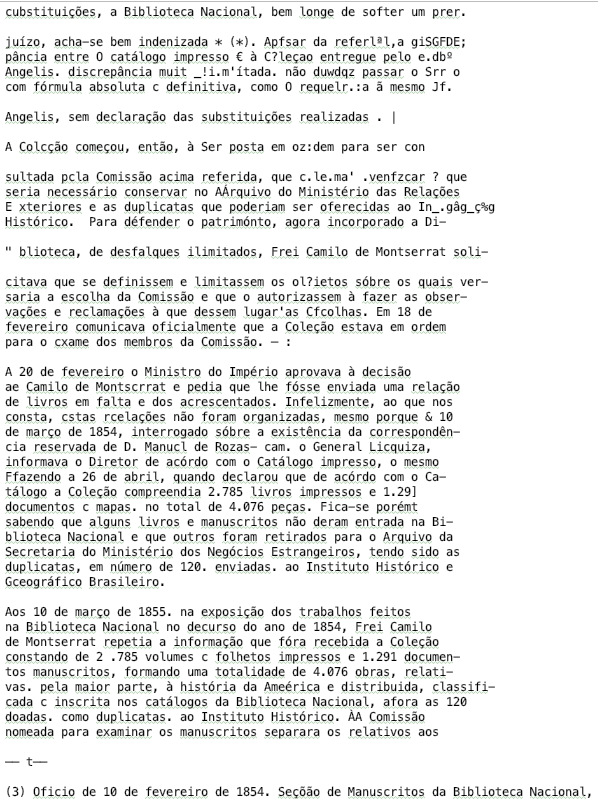

OCR
===
Get processors' ID
------------------------
First, we should let each processor get its own ID number so that it can read its corresponding child checkpoint file and start to work on the jobs assigned to it. ::

 from PIL import Image
 import pytesseract
 import csv
 import time
 from optparse import OptionParser, Option, OptionValueError

 def list_callback(option, opt, value, parser):
     setattr(parser.values, option.dest, value.split(','))

 parser = OptionParser()
 parser.add_option("-p", action="store", type="str", dest="proc_id")

 (options, args) = parser.parse_args()

 proc_id = options.proc_id

Child checkpoint file
---------------------
Second, each processor will create another child checkpoint file named checkpoint_i_DONE.csv to record the jobs that have been done. In the beginning, there is none in this file. ::

 with open("checkpoint_" + str(proc_id) + "_" + "DONE" + ".csv", "w") as c:
     writer = csv.writer(c)
     writer.writerow(["File Path"])

Read images with OCR
--------------------
Next step is the most important part as OCR will start to read the images according to the TODO lists. In order to do the benchmark, we take the records of the time that each time OCR takes to read one image. The jobs that have been done will also be marked on the DONE lists. ::

 time_label = []
 dict1 = {}

 with open("checkpoint_" + str(proc_id) + "_" + "TODO" + ".csv", "r") as c3:
     reader = csv.reader(c3)
     paths = [row for row in reader]
     cur = len(paths)

     for j in range(1, len(paths)):
         img = paths[j][0]

         start = time.time()
         text = pytesseract.image_to_string(Image.open(img), lang='eng', config=r'--tessdata-dir "/usr/local/Cellar/tesseract/4.0.0_1/share/tessdata/"')
         end = time.time()
         time_label.append(end-start)

         output = str(paths[j][0]).replace("/dataset/", "/output/")
         output = output.replace(".jpg", ".txt")
         out = open(str(output), "w")
         out.write(text)
         out.close()

        with open("checkpoint_" + str(proc_id) + "_" + "DONE" + ".csv", "a") as c4:
            writer = csv.writer(c4)
            writer.writerow([paths[j][0]])

        with open("checkpoint_" + str(proc_id) + "_" + "DONE" + ".csv", "r", encoding="utf-8") as f:
            reader = csv.reader(f)
            names = [row for row in reader]
            del names[0]

            dict1.update({names[i][0]: "T" for i in range(len(names))})

Below are 3 groups of original pages and their OCR outputs: 

Page 1:

Result 1:

Page 2 and 3:

Result 2:

Result 3: 

Time
----
We write the average time of each image processing into a file named timing.csv. In the end, this file will show us how many images each processor has read and how long it takes. ::

 whole_time = 0
 for i in range(cur):
     whole_time += time_label[i]

 with open("timing.csv", "a") as t1:
     writer = csv.writer(t1)
     writer.writerow([cur, whole_time/cur])

