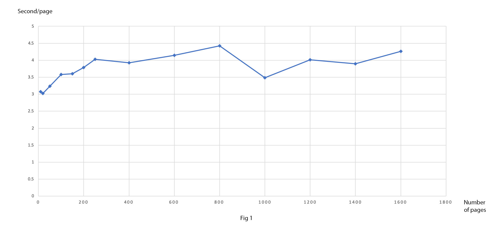
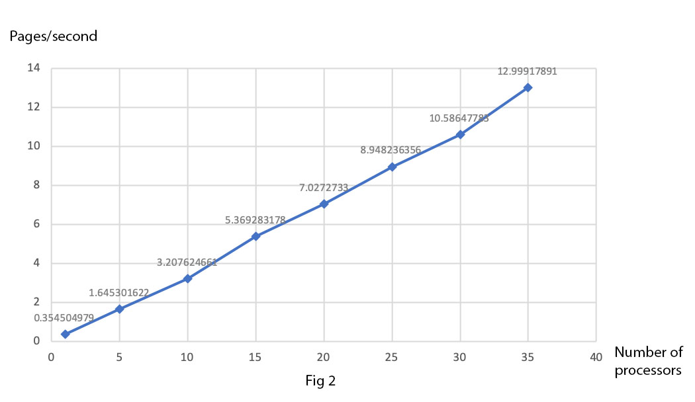
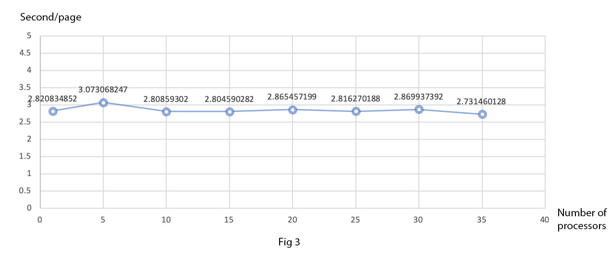

Run OCR on HTC
==============
The number of job array correspond to the number of processors that we set in the previous slurm file. For example, we set the number of processors as 30 in the previous slurm file, then we should set array as 0-29 or 1-30 to ensure there are 30 processors in total. ::

 #!/bin/bash
 #SBATCH --job-name=ocr
 #SBATCH --partition=commons
 #SBATCH --ntasks=1
 #SBATCH --time=00:30:00
 #SBATCH --export=ALL
 #SBATCH --mail-user= ##Enter your email
 #SBATCH --mail-type=ALL
 #SBATCH --array=0-29  ##The number of the processors

 module load GCC/7.3.0 OpenMPI/3.1.2
 module load Python/3.6.6
 pip3 install --user pytesseract

 sh -c "$(curl -fsSL https://raw.githubusercontent.com/Linuxbrew/install/master/install.sh)"

 echo "export PATH=/home/hy31/.linuxbrew/bin/:$PATH" >> ~/.bash_profile && source ~/.bash_profile

 brew install tesseract

 python ocr.py -p $SLURM_ARRAY_TASK_ID

In Figure 1, vertical axis represents the average time that one page takes to do the OCR process and horizontal axis represents how many pages are processed in total. We can see that when there are fewer pages being processed, the speed of OCR is a little bit faster. When the number of pages is large, the speed of OCR will gradually maintain steady.

In Figure 2, vertical axis represents the number of pages that can be processed in one second and horizontal axis represents how many processors are used. It is clear to see that as the number of processors increases, more pages can be processed by OCR in one second. This graph shows the largest advantage of HTC: more than one processor means multiple jobs can be done at the same time. 

In Figure 3, vertical axis represents the average time that one page takes to do the OCR process and horizontal axis represents the number of processors used. The shape of flat curve shows that the number of processors does not affect the speed of OCR.

